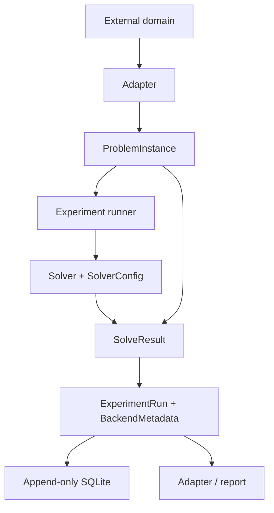

# VariaQ architecture

VariaQ separates domain problems, solver implementations, normalized results,
and durable experiment records. Different computational methods can operate on
the same instance without redefining correctness.

VariaQ is pre-1.0. These are intentional extension boundaries, but their Python
APIs may evolve before 1.0.

## Data flow

External applications should exchange classical artifacts through adapters.
Domain concepts do not belong in VariaQ core.

## Current interfaces

### `ProblemInstance`

Owns solver-independent definition, deterministic identity, serialization,
validation, optimization sense, and authoritative candidate evaluation. MaxCut
is the first implementation.

### `Solver`

Implements `solve(problem, config) -> SolveResult`. A solver may reject
unsupported families or unsafe sizes. It must not reinterpret the objective or
silently execute remotely.

### `SolverConfig`

Contains the seed and solver parameters and is serialized with every run.

### `SolveResult`

Normalizes solution, objective, feasibility, violations, timing, backend,
status, errors, warnings, best-known comparison, gap, and approximation data.
Unavailable values remain absent rather than fabricated.

### `BackendMetadata`

Describes framework, target, locality, versions, reproducibility notes, and
backend-specific metrics. The metrics mapping permits new measurements without
a schema migration for every backend.

### `ExperimentRun`

Combines immutable problem content, configuration, normalized result,
environment snapshot, run and benchmark identity, and optional `rerun_of`
lineage.

## Package responsibilities

- `variaq.problems`: contracts and authoritative MaxCut evaluation.
- `variaq.solvers`: exact, heuristic, Qiskit, CUDA-Q, and shared QAOA search.
- `variaq.experiments`: execution, comparison, reproduction, and SQLite.
- `variaq.models`: serializable configuration, result, and metadata models.
- `variaq.cli`: local command-line workflows.

## Solver-independent evaluation

Backends return canonical candidates. `MaxCutProblem.evaluate` determines final
objective and feasibility. This prevents backend bit ordering or Hamiltonian
conventions from silently changing the experiment.

## Shared variational search

For matched QAOA experiments VariaQ:

1. generates one ordered sequence from depth, trial count, and seed;
2. supplies it unchanged to every selected quantum adapter;
3. collects expectations;
4. selects by one shared ranking rule;
5. samples through each backend;
6. evaluates samples with the authoritative problem evaluator.

Adapters implement expectation and sampling, not optimizer policy. See
[docs/matched-quantum-benchmarks.md](docs/matched-quantum-benchmarks.md).

## Canonical order

Solutions are `(variable_0, variable_1, ...)`. Qiskit integer bit `i` and
CUDA-Q q0-first sample character `i` both map to variable `i`. Tests use
objective-sensitive asymmetric cases so reversal cannot pass unnoticed.

## Persistence and rename compatibility

SQLite schema version 1 stores immutable problem definitions and append-only run
records with complete JSON snapshots. The public rename does not rewrite
historical data. Pre-release records may legitimately identify `q-lab` in
captured environment metadata.

Persistence contains data schemas rather than serialized Python module paths,
so no duplicate `qlab` package is required. Reproduction resolves the stored
solver name through the current registry and creates a new lineage-linked
VariaQ record.

New storage defaults to `data/variaq.sqlite3`. If it is absent and the
pre-release `data/qlab.sqlite3` exists, the CLI opens the legacy file without
migrating or overwriting it.

## Safety boundaries

- implemented backends are local;
- non-local results become structured failures;
- no IBM Runtime/provider or physical-QPU path exists;
- exact and statevector solvers have explicit limits;
- CUDA-Q estimates memory before execution;
- missing frameworks and GPUs do not break unrelated solvers.

## Future extension areas

- new problem families and classical solvers;
- additional simulators and explicitly authorized QPU providers;
- external domain adapters;
- analysis, export, and reporting integrations.

These are directions, not implemented features or stability guarantees.
