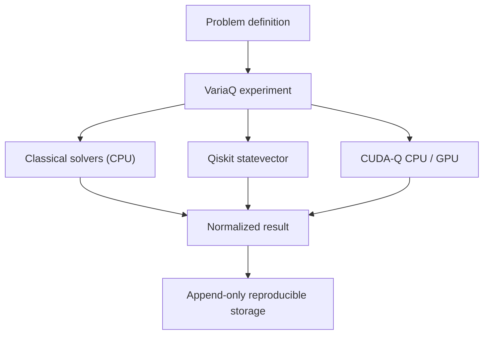

# VariaQ

**Reproducible hybrid-compute experimentation.**

VariaQ is a local-first, self-hostable platform for comparing classical,
GPU-accelerated, and quantum computational methods under controlled,
reproducible conditions.

VariaQ does not assume quantum methods provide an advantage. It is built to
measure when quantum methods are useful, competitive, or impractical.

**Classical · GPU · Quantum**

## Why VariaQ exists

Cross-framework comparisons are easy to distort accidentally. Different
objectives, optimizer behavior, bit ordering, seeds, shot budgets, or parameter
vectors can make nominally identical experiments scientifically incomparable.
VariaQ separates the authoritative problem definition from solvers, normalizes
results, and stores the configuration, environment, timing, outcome, and
reproduction lineage locally.

## What VariaQ is—and is not

VariaQ is a small research harness for controlled, local, reproducible solver
comparisons. It is explicit about unavailable backends and negative quantum
results, and is designed to grow through problem, solver, backend, and adapter
boundaries.

VariaQ is not a claim of quantum advantage, production scheduler, distributed
service, hardware benchmark based on simulator speed, web service, telemetry
collector, or cloud-account requirement. It cannot currently submit work to a
physical QPU.

## Current capabilities

VariaQ 0.5 supports domain-neutral optimization problem families:

- **MaxCut** — weighted graph partitioning into two sets.
- **Assignment** — tasks/resources with scores, costs, capacities, demands, and
  prohibited pairs.
- **Subset Selection** — bounded candidate selection with individual value, cost,
  budget, cardinality bounds, and pairwise interactions.
- **Graph Partitioning** — k-way weighted graph partitioning with optional size
  balance constraints.

All four families support exact and heuristic classical solvers. Quantum
solvers consume a shared backend-neutral Binary Quadratic Model (BQM) and
support:

- **MaxCut**: Qiskit local statevector QAOA, CUDA-Q `qpp-cpu`, and CUDA-Q
  NVIDIA simulators.
- **Assignment**, **Subset Selection**: same generic QAOA pipeline; availability
  depends on the installed quantum backend and the binary-variable budget (see
  `variaq capabilities --json`).
- **Graph Partitioning**: BQM lowering is implemented and tested, but quantum
  support is experimental and not advertised for 0.5.0.

Solvers:

- exact enumeration with configurable state guards,
- seeded multistart local-search heuristic,
- Qiskit local statevector QAOA,
- CUDA-Q `qpp-cpu` QAOA,
- CUDA-Q `nvidia` and `nvidia-fp64` adapters when compatible hardware exists.

Cross-cutting features:

- solver-independent canonical objective evaluation; the original problem is
  always authoritative for feasibility, objective, and decoding,
- objective-sense-aware metrics (maximize/minimize),
- backend-neutral Binary Quadratic Model lowering with explicit penalty terms,
- generic QAOA layer shared by Qiskit and CUDA-Q with matched parameter
  vectors and variable ordering,
- explicit feasible/infeasible sample handling and constraint violation reporting,
- statevector memory guards based on binary variable count,
- append-only SQLite experiment history and rerun lineage,
- structured failures and capability-aware unavailable outcomes,
- deterministic reference instance generators,
- machine-readable problem import/export,
- a small public domain-adapter SDK,
- adapter scaffolding via the CLI,
- versioned machine-readable JSON output for scripts, plugins, and CI.

## Architecture



The major contracts are `ProblemInstance`, `Solver`, `SolverConfig`,
`SolveResult`, `ExperimentRun`, and `BackendMetadata`. Problems own
correctness; the authoritative evaluator decides objective and feasibility.
VariaQ is pre-1.0, so these deliberate extension boundaries are not yet stable
API promises. See [ARCHITECTURE.md](ARCHITECTURE.md).

Domain-specific projects connect through small external **adapters**; see
[`docs/domain-adapters.md`](docs/domain-adapters.md) and
[`docs/problem-families.md`](docs/problem-families.md).

## Installation

VariaQ is not published to PyPI. After the public repository exists, replace
`aaronphifer` below with the GitHub owner:

```bash
git clone https://github.com/aaronphifer/variaq.git
cd variaq
python -m venv .venv
source .venv/bin/activate
python -m pip install --upgrade pip
```

Choose the smallest installation needed:

```bash
python -m pip install -e .                    # exact and heuristic
python -m pip install -e '.[quantum]'         # add Qiskit
python -m pip install -e '.[cudaq]'           # add CUDA-Q
python -m pip install -e '.[dev,quantum,cudaq]'
```

Python 3.12 or newer is required. CUDA-Q remains bounded to
`>=0.16,<0.17` because upstream `observe` and `sample` interfaces are
changing; the adapter must be reverified before widening the bound. CUDA-Q may
download NVIDIA runtime libraries even for CPU-only use. VariaQ never installs
drivers or system CUDA packages.

## Quick start

This deterministic local workflow needs the `quantum` extra but no credentials,
network, or QPU time:

```bash
variaq capabilities --json
variaq problem generate maxcut \
  --nodes 8 \
  --edge-probability 0.4 \
  --seed 42

variaq benchmark <problem-id> \
  --solvers exact,heuristic,qaoa \
  --seed 42 \
  --json | jq .

variaq runs list
variaq runs show <run-id>
variaq runs reproduce <run-id>
```

```bash
variaq campaign plan examples/campaigns/maxcut_scaling.json --json
variaq campaign run examples/campaigns/maxcut_scaling.json --json
variaq analyze campaign <campaign-id> --json
variaq report campaign <campaign-id> --output-dir ./reports
```

New in 0.4:

```bash
variaq problem generate assignment --task-count 6 --resource-count 4 --seed 1
variaq problem generate subset-selection --candidate-count 8 --seed 2
variaq problem generate graph-partition --nodes 8 --edge-probability 0.3 --partition-count 3 --seed 3

variaq adapter init my-adapter --family assignment
```

Machine-readable output uses a stable, versioned envelope documented in
[`docs/structured-output.md`](docs/structured-output.md). The same `--json`
flag works for `solve`, `benchmark`, `compare quantum`, `capabilities`, and the
`runs` commands.

An executable example is in
[`examples/maxcut_quickstart`](examples/maxcut_quickstart/).

## Integrating your project

VariaQ core stays domain-neutral. To connect an external project, write a small
adapter that translates your objects into one of VariaQ's generic families and
maps the result back. See:

- [`docs/domain-adapters.md`](docs/domain-adapters.md) — adapter contract and
  example.
- [`docs/problem-families.md`](docs/problem-families.md) — family definitions and
  solver support matrix.
- `variaq adapter init <name> --family <family>` — scaffold a template.

Do not put project-specific semantics in VariaQ core; use an adapter.

## MaxCut reference experiment

Problem IDs derive from canonical mathematical content. JSON also preserves
generation provenance. Every solver receives the same immutable instance, while
the exact solver establishes the optimum when included:

```bash
variaq solve <problem-id> --solver exact --seed 42
variaq solve <problem-id> --solver heuristic --seed 42 --param restarts=32
variaq solve <problem-id> --solver qaoa --seed 42 \
  --param p=1 --param optimizer_trials=32 --param shots=1024

variaq solve <problem-id> --solver exact --seed 42 --json | jq .
```

## Matched Qiskit/CUDA-Q experiment

```bash
variaq compare quantum <problem-id> \
  --solvers qaoa,cudaq-cpu,cudaq-gpu \
  --p 1 --optimizer-trials 32 --shots 1024 --seed 42
```

VariaQ generates candidates once per repeat and supplies the same ordered
vectors to every quantum adapter. It holds constant the graph and weights,
objective, initial state, Hamiltonian and rotation conventions, QAOA depth,
parameter ordering, candidate sequence, seed where supported, shot count,
canonical variable ordering, and final evaluator.

## Reproducibility and local-first privacy

By default VariaQ runs locally, stores problem files under `data/problems/`
and history in `data/variaq.sqlite3`, requires no cloud or QPU account, uploads
no data, and includes no analytics or telemetry.

Records contain full problem and solver snapshots, seeds, environment versions,
backend metadata, timing, status, warnings or errors, and `rerun_of` lineage.
They are append-only and never silently overwritten.

Databases created under the pre-release Q-Lab development name remain readable.
If `data/variaq.sqlite3` is absent but `data/qlab.sqlite3` exists, the CLI
opens the legacy path without migration. Historical metadata remains unchanged.

## Physical-QPU safety policy

VariaQ 0.4 has no physical-QPU backend, provider discovery, credentials, or job
submission. A future integration must require unmistakable intent, conceptually
both `--backend ibm:<backend>` and `--allow-qpu`. Without explicit
authorization, physical-QPU execution must remain impossible.

## Current limitations

- Quantum solvers are ideal local statevector simulations. Quantum support for
  non-MaxCut families uses the same generic BQM path but may require larger
  binary-variable budgets and is not guaranteed to reach the global optimum.
- CUDA-Q GPU execution has not been physically verified by the project.
- Peak memory is recorded only when a trustworthy source exists.
- Public extension APIs may change before 1.0.

## Roadmap, related work, and external adapters

See [ROADMAP.md](ROADMAP.md) and
[`docs/related-work.md`](docs/related-work.md). Future external consumers may
include cybersecurity, AI-agent scheduling, logistics, graph optimization, and
scientific computing. Domain concepts stay outside VariaQ core:

```text
external domain -> adapter -> VariaQ problem -> solver/backend
                -> VariaQ result -> adapter -> domain artifact
```

## Contributing

See [CONTRIBUTING.md](CONTRIBUTING.md). New quantum backends require
fixed-parameter, sign/angle, bit-order, independent-objective, metadata,
failure-handling, and remote-execution safety validation where applicable.

## License

VariaQ is licensed under the [Apache License 2.0](LICENSE).
