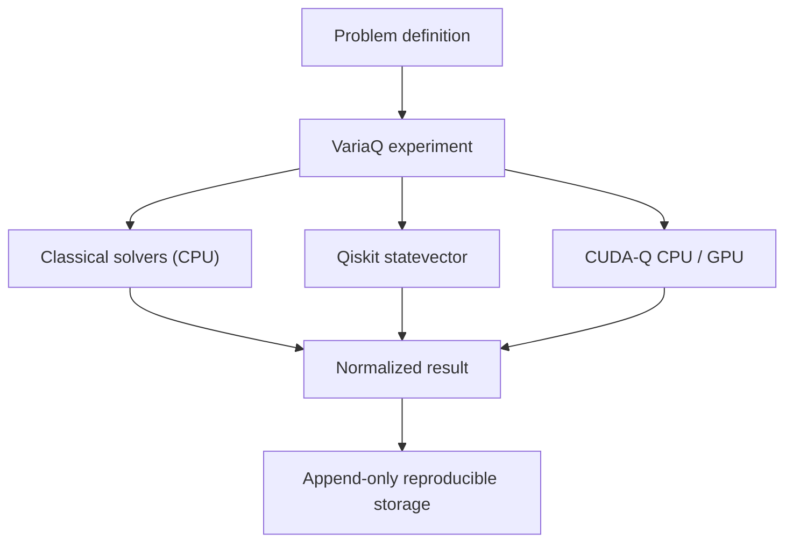

# VariaQ

**Reproducible hybrid-compute experimentation.**

VariaQ is a local-first, self-hostable platform for comparing classical,
GPU-accelerated, and quantum computational methods under controlled,
reproducible conditions.

VariaQ does not assume quantum methods provide an advantage. It is built to
measure when quantum methods are useful, competitive, or impractical.

**Classical · GPU · Quantum**

## Why VariaQ exists

Cross-framework comparisons are easy to distort accidentally. Different
objectives, optimizer behavior, bit ordering, seeds, shot budgets, or parameter
vectors can make nominally identical experiments scientifically incomparable.
VariaQ separates the authoritative problem definition from solvers, normalizes
results, and stores the configuration, environment, timing, outcome, and
reproduction lineage locally.

## What VariaQ is—and is not

VariaQ is a small research harness for controlled, local, reproducible solver
comparisons. It is explicit about unavailable backends and negative quantum
results, and is designed to grow through problem, solver, backend, and adapter
boundaries.

VariaQ is not a claim of quantum advantage, production scheduler, distributed
service, hardware benchmark based on simulator speed, web service, telemetry
collector, or cloud-account requirement. It cannot currently submit work to a
physical QPU.

## Current capabilities

VariaQ 0.2 supports bounded weighted MaxCut with:

- exact enumeration with a 24-variable guard;
- seeded multistart local search;
- Qiskit local statevector QAOA;
- CUDA-Q `qpp-cpu` QAOA;
- CUDA-Q `nvidia` and `nvidia-fp64` adapters when compatible hardware exists;
- identical matched QAOA candidates across Qiskit and CUDA-Q;
- canonical variable ordering and solver-independent objective evaluation;
- append-only SQLite experiment history and rerun lineage;
- structured failures and capability-aware unavailable outcomes;
- deterministic 4–16 node benchmark configurations.

MaxCut is the first reference problem because it is bounded, easily verified,
exactly solvable at small sizes, and maps naturally to QAOA, QUBO, and Ising
formulations. It is a validation target, not VariaQ's intended limit.

## Architecture



The major contracts are `ProblemInstance`, `Solver`, `SolverConfig`,
`SolveResult`, `ExperimentRun`, and `BackendMetadata`. Problems own
correctness; the authoritative evaluator decides objective and feasibility.
VariaQ is pre-1.0, so these deliberate extension boundaries are not yet stable
API promises. See [ARCHITECTURE.md](ARCHITECTURE.md).

## Installation

VariaQ is not published to PyPI. After the public repository exists, replace
`aaronphifer` below with the GitHub owner:

```bash
git clone https://github.com/aaronphifer/variaq.git
cd variaq
python -m venv .venv
source .venv/bin/activate
python -m pip install --upgrade pip
```

Choose the smallest installation needed:

```bash
python -m pip install -e .                    # exact and heuristic
python -m pip install -e '.[quantum]'         # add Qiskit
python -m pip install -e '.[cudaq]'           # add CUDA-Q
python -m pip install -e '.[dev,quantum,cudaq]'
```

Python 3.12 or newer is required. CUDA-Q remains bounded to
`>=0.16,<0.17` because upstream `observe` and `sample` interfaces are
changing; the adapter must be reverified before widening the bound. CUDA-Q may
download NVIDIA runtime libraries even for CPU-only use. VariaQ never installs
drivers or system CUDA packages.

## Quick start

This deterministic local workflow needs the `quantum` extra but no credentials,
network, or QPU time:

```bash
variaq problem generate maxcut \
  --nodes 8 \
  --edge-probability 0.4 \
  --seed 42

variaq benchmark <problem-id> \
  --solvers exact,heuristic,qaoa \
  --seed 42

variaq runs list
variaq runs show <run-id>
variaq runs reproduce <run-id>
```

An executable example is in
[`examples/maxcut_quickstart`](examples/maxcut_quickstart/).

## MaxCut reference experiment

Problem IDs derive from canonical mathematical content. JSON also preserves
generation provenance. Every solver receives the same immutable instance, while
the exact solver establishes the optimum when included:

```bash
variaq solve <problem-id> --solver exact --seed 42
variaq solve <problem-id> --solver heuristic --seed 42 --param restarts=32
variaq solve <problem-id> --solver qaoa --seed 42 \
  --param p=1 --param optimizer_trials=32 --param shots=1024
```

## Matched Qiskit/CUDA-Q experiment

```bash
variaq compare quantum <problem-id> \
  --solvers qaoa,cudaq-cpu,cudaq-gpu \
  --p 1 --optimizer-trials 32 --shots 1024 --seed 42
```

VariaQ generates candidates once per repeat and supplies the same ordered
vectors to every quantum adapter. It holds constant the graph and weights,
objective, initial state, Hamiltonian and rotation conventions, QAOA depth,
parameter ordering, candidate sequence, seed where supported, shot count,
canonical variable ordering, and final evaluator.

In the verified 8-node v0.2 experiment, Qiskit and CUDA-Q CPU both found
objective 12. The maximum expectation difference across 32 identical candidates
was approximately `2.84e-14`; verified p=2 cases differed by no more than about
`5.77e-15`. This validates numerical equivalence of those tested
implementations within floating-point tolerance. It does not demonstrate
quantum advantage. See
[the methodology](docs/matched-quantum-benchmarks.md).

## Reproducibility and local-first privacy

By default VariaQ runs locally, stores problem files under `data/problems/`
and history in `data/variaq.sqlite3`, requires no cloud or QPU account, uploads
no data, and includes no analytics or telemetry.

Records contain full problem and solver snapshots, seeds, environment versions,
backend metadata, timing, status, warnings or errors, and `rerun_of` lineage.
They are append-only and never silently overwritten.

Databases created under the pre-release Q-Lab development name remain readable.
If `data/variaq.sqlite3` is absent but `data/qlab.sqlite3` exists, the CLI
opens the legacy path without migration. Historical metadata remains unchanged.

## Optional CUDA-Q and GPU status

```bash
variaq solve <problem-id> --solver cudaq-cpu --seed 42 \
  --param p=1 --param optimizer_trials=32 --param shots=1024

variaq solve <problem-id> --solver cudaq-gpu --seed 42 \
  --param p=1 --param optimizer_trials=32 --param shots=1024 \
  --param precision=fp32
```

`cudaq-gpu` uses `nvidia` for fp32 and `nvidia-fp64` for fp64.

**NVIDIA GPU exercised during v0.2 verification: NO.** The host reported zero
compatible CUDA-Q NVIDIA devices and no usable `nvidia-smi`. No GPU performance
conclusion has been made. Unsupported GPU requests are stored as `unavailable`,
not failed scientific results. Contributors should submit complete reproducible
benchmark information rather than anecdotal performance claims.

## Timing and scaling

```bash
variaq compare quantum <problem-id> --warmup --repeats 10
variaq suite --config benchmarks/maxcut_scaling_v0.2.json
```

Statevector memory grows as `2^n` complex amplitudes. Qiskit and CUDA-Q retain
a 16-variable guard; CUDA-Q also checks an estimated byte limit. Initialization,
warm-up, search, expectation, sampling, and total wall timing remain distinct
where measurable. One tiny cold run is not a valid speed comparison.

## Physical-QPU safety policy

VariaQ 0.2 has no physical-QPU backend, provider discovery, credentials, or job
submission. A future integration must require unmistakable intent, conceptually
both `--backend ibm:<backend>` and `--allow-qpu`. Without explicit
authorization, physical-QPU execution must remain impossible.

## Current limitations

- MaxCut is the only implemented problem family.
- Quantum solvers are ideal local statevector simulations.
- CUDA-Q GPU execution has not been physically verified by the project.
- Peak memory is recorded only when a trustworthy source exists.
- Public extension APIs may change before 1.0.

## Roadmap, related work, and external adapters

See [ROADMAP.md](ROADMAP.md) and
[`docs/related-work.md`](docs/related-work.md). Future external consumers may
include cybersecurity, AI-agent scheduling, logistics, graph optimization, and
scientific computing. Domain concepts stay outside VariaQ core:

```text
external domain -> adapter -> VariaQ problem -> solver/backend
                -> VariaQ result -> adapter -> domain artifact
```

## Contributing

See [CONTRIBUTING.md](CONTRIBUTING.md). New quantum backends require
fixed-parameter, sign/angle, bit-order, independent-objective, metadata,
failure-handling, and remote-execution safety validation where applicable.

## License

VariaQ is licensed under the [Apache License 2.0](LICENSE).
